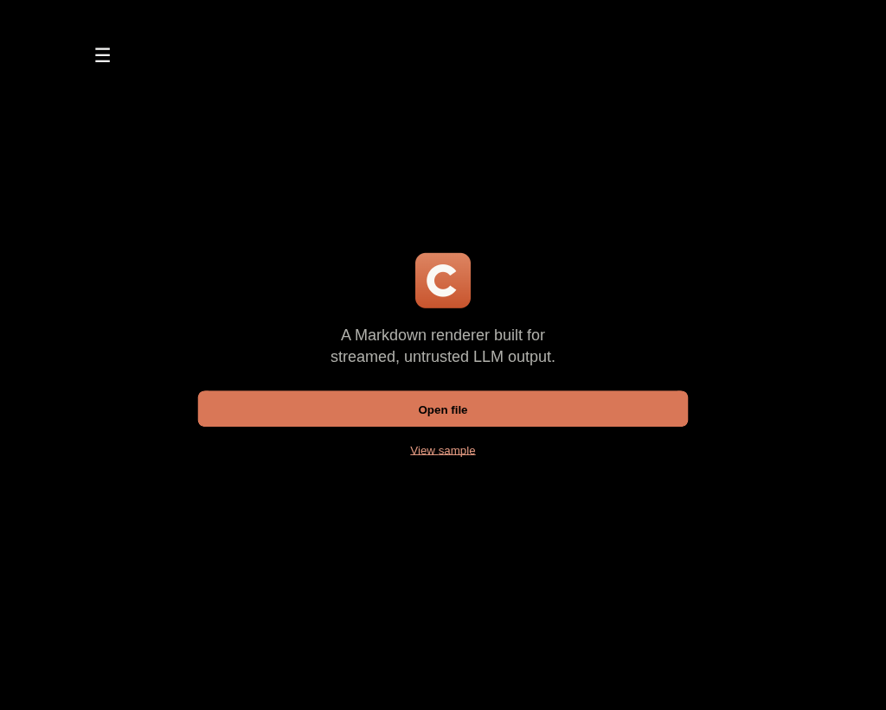
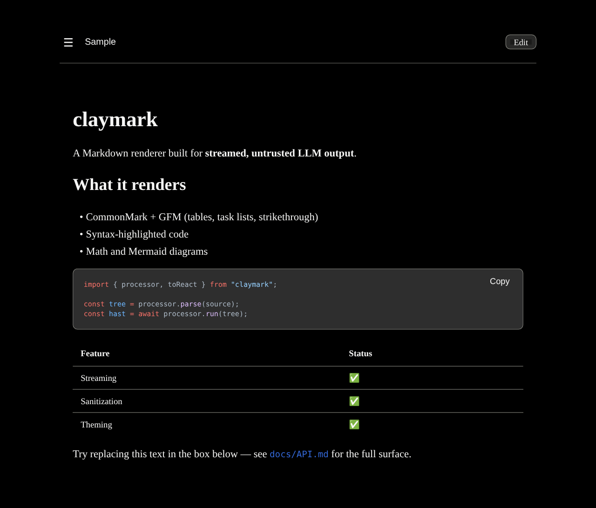
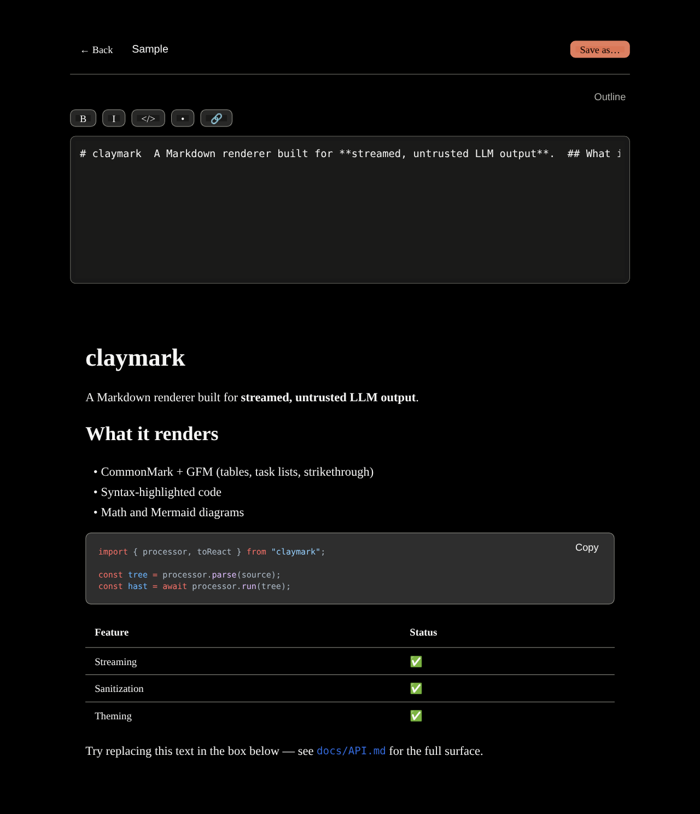
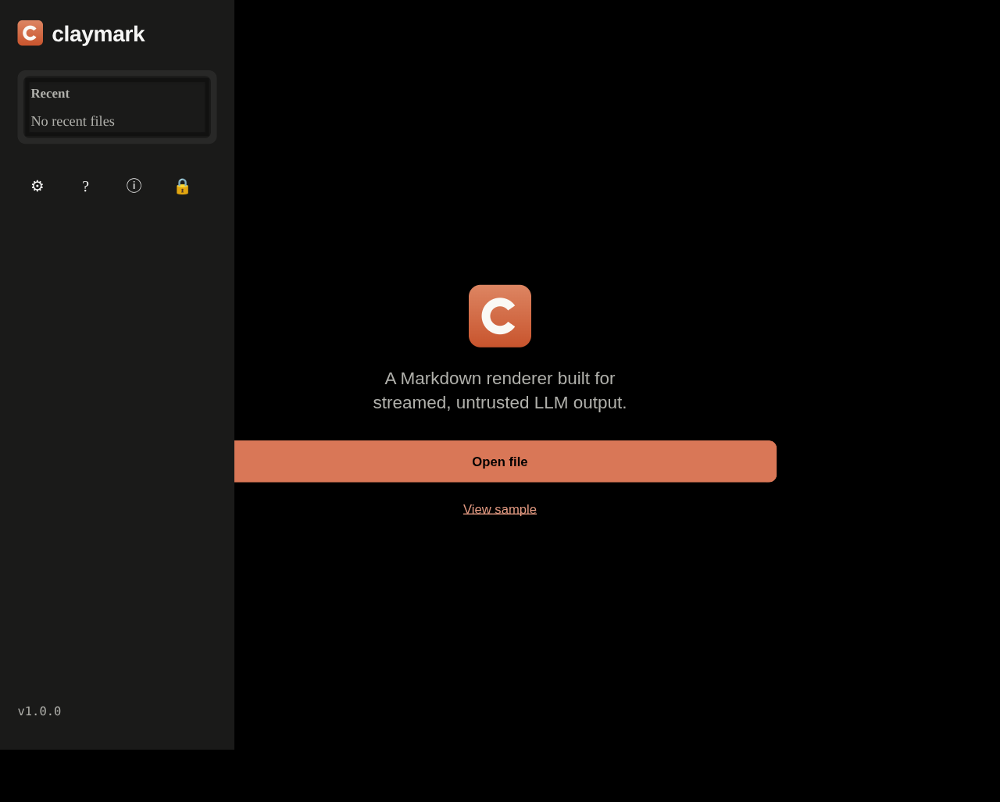
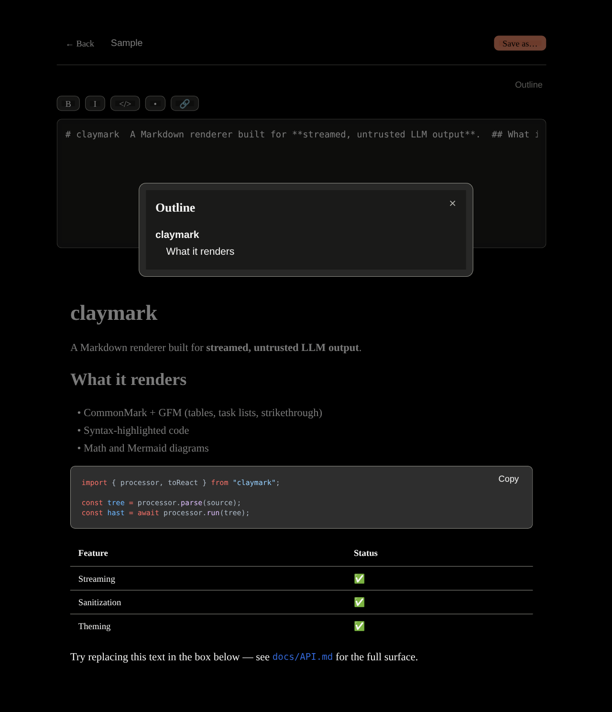
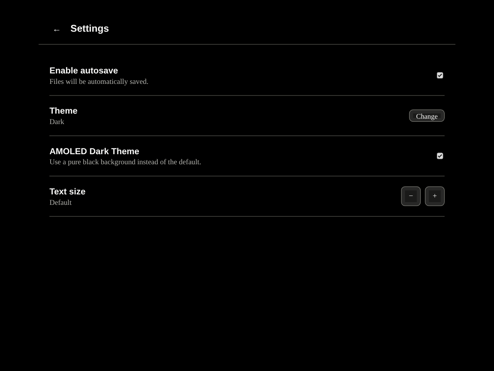
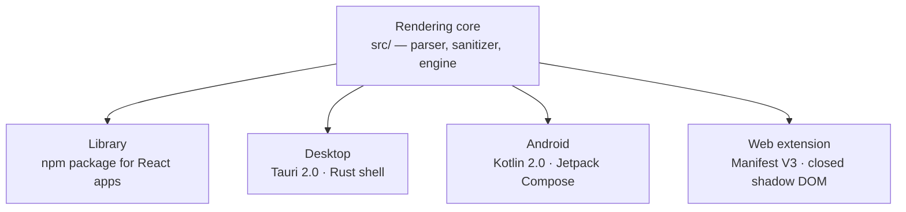

# Claymark

<p align="center">
  
</p>

<p align="center">
  <strong>A pixel-faithful, security-hardened Markdown rendering engine.</strong><br/>
  Built for streamed, incomplete, untrusted text. Renders it. Never executes it.
</p>

<p align="center">
  
  
  
  
  
  
  
  
  
</p>

**Claymark** is a Markdown rendering engine for React, shipped four ways: as an npm library, a Tauri desktop app, a native Android app, and a Manifest V3 browser extension.

Most Markdown renderers assume they're handed a finished document. Claymark assumes the opposite, a stream of tokens arriving from an LLM, one chunk at a time, that has to become a stable, typeset page while it's still incomplete, without flickering, without breaking, and without ever executing anything the document contains. That constraint shaped everything downstream of it: the diff-based render path, the sanitizer that runs on every frame, and the decision to treat every document as hostile input by default.

One rendering core. One security model. Four surfaces.

---

## Screenshots

<table>
  <tr>
    <td align="center" width="33%"><br/><sub>Welcome</sub></td>
    <td align="center" width="33%"><br/><sub>Reader mode</sub></td>
    <td align="center" width="33%"><br/><sub>Edit mode</sub></td>
  </tr>
  <tr>
    <td align="center" width="33%"><br/><sub>File drawer</sub></td>
    <td align="center" width="33%"><br/><sub>Table of contents</sub></td>
    <td align="center" width="33%"><br/><sub>Settings</sub></td>
  </tr>
</table>

The web extension ships its own popup and in-page reader surface, see [`web-extension/tests/screenshots/`](web-extension/tests/screenshots/) for the full set.

---

## Why Claymark

A `<script>` tag hidden in a document isn't a hypothetical when the document is arriving from a model that was itself fed untrusted input somewhere upstream. Claymark treats the renderer as the trust boundary, not a linter pass, not a "sanitize on save" step, a boundary the content can never cross, enforced on every render, by construction.

| Capability | Claymark | A `dangerouslySetInnerHTML` renderer | A generic Markdown-to-HTML library | An iframe-sandboxed viewer |
|---|---|---|---|---|
| Streams incomplete Markdown without flicker | ✅ | Partial | ❌ | Partial |
| Blocks all raw HTML in documents | ✅ | ❌ | Partial | ✅ |
| Zero runtime network requests | ✅ | ❌ | ❌ | Partial |
| Sanitizes on every render, not once at parse | ✅ | ❌ | ❌ | N/A |
| Typeset math (KaTeX) with MathML for screen readers | ✅ | Partial | ❌ | Partial |
| Diagrams (Mermaid) with text alternatives | ✅ | Partial | ❌ | Partial |
| WCAG 2.2 AA in both themes | ✅ | ❌ | ❌ | Partial |
| Native shell on desktop, Android, and browser | ✅ | ❌ | ❌ | ❌ |
| Works fully offline after first load | ✅ | Partial | ✅ | Partial |

---

## The four surfaces



| Surface | What it is | Where it lives |
|---|---|---|
| **Library** | The rendering engine itself, published as an npm package for embedding in an existing React app | [`src/`](src/) |
| **Desktop** | A native app built on Tauri 2.0, a Rust shell around the same rendering core | [`desktop/`](desktop/) |
| **Android** | A native Jetpack Compose app (Kotlin 2.0, min SDK 26) with its own document backend | [`android/`](android/) |
| **Web extension** | A Manifest V3 extension that turns any `.md` URL into a rendered reading surface, isolated from the host page behind a closed shadow root | [`web-extension/`](web-extension/) |

Every surface shares the same non-negotiable: it renders, it never executes.

---

## What it does

- Renders GitHub-Flavored Markdown into a serif reading surface with syntax-highlighted code (34 languages), typeset mathematics (KaTeX), diagrams (Mermaid), and readable tables.
- Streams. Partial fences, half-closed bold, mid-token math delimiters, none of it breaks the render or flashes unstyled content.
- Refuses to execute. Raw HTML in a document is shown as text, never rendered. There is no `dangerouslySetInnerHTML` path for document content, on any surface.
- Works offline, everywhere. Zero runtime network requests is a shipped guarantee, not an aspiration.
- Follows the system theme, respects `prefers-reduced-motion`, and holds WCAG 2.2 AA in both themes, including MathML for screen readers and text alternatives for diagrams.

## What it deliberately refuses to do

| Behavior | Why |
|---|---|
| Render raw HTML from a document | HTML in untrusted input is the primary attack surface. Disabled entirely, no override. |
| Let a document load a remote resource | Zero runtime network requests is what makes offline reliable and tracking structurally impossible. |
| Let a document style itself | A document that can restyle itself can disguise itself. |
| Make task checkboxes interactive | This is a renderer, not a form. State lives in the source, not in the DOM. |
| Highlight an unregistered language | Bundling every grammar multiplies the download size for a feature most documents never use. |

These read like missing features. They're decisions, and they're load-bearing ones.

---

# Quick start

## Library

```bash
pnpm install
pnpm build       # library build
pnpm test        # full test suite
pnpm lint
```

## Desktop (Tauri)

```bash
cd desktop
pnpm tauri dev      # from repo root, or:
pnpm tauri build
```

## Android

```bash
cd android
./gradlew assembleDebug
```

APK lands at `android/app/build/outputs/apk/debug/`.

## Web extension

```bash
cd web-extension
npm install
npm run build
```

Load the unpacked build from `web-extension/claymark-extension/` via `chrome://extensions`.

Each surface's own README has the full walkthrough: [`desktop/README.md`](desktop/README.md), [`android/README.md`](android/README.md), [`web-extension/README.md`](web-extension/README.md).

---

## Performance budgets

Not targets. Budgets, measured on a mid-tier 2020 laptop, cold cache, and enforced by the test suite.

| Metric | Budget |
|---|---|
| First render, 2 KB document | < 16 ms |
| First render, 100 KB document | < 250 ms |
| Streaming append, per token | < 4 ms |
| Initial bundle, core only | < 120 KB gzipped |
| Cumulative layout shift | 0 |
| Memory, 10k-render soak | < 150 MB steady state |

---

# Security model

Claymark's entire reason for existing is rendering untrusted content without letting it execute. That makes the sanitizer a security boundary, not a convenience feature.

### Sanitize on every render, not once at parse

Document content passes through `rehype-sanitize` and `DOMPurify` on every render pass, including streamed partial content, rather than being cleaned once and trusted afterward.

### No raw HTML, no override

Raw HTML in a document renders as literal text. There is no escape hatch, no "trusted mode," no prop that turns it back on.

### Closed shadow DOM on the extension surface

The web extension's in-page reader renders inside a `mode: 'closed'` shadow root. The host page it's reading cannot reach in, and the extension's own DOM cannot leak into the page around it.

### Zero runtime network requests

A document cannot cause a fetch, an image load from a non-allowed scheme, or any other outbound request. Only `http`, `https`, and image `data:` URIs are permitted, and even those never originate from the renderer itself at runtime.

### Restricted URL policy

Links and image sources are checked against an explicit scheme allowlist before they're ever placed in the DOM.

The full audit trail, including every dependency vulnerability found and fixed, lives in [`SECURITY-AUDIT.md`](SECURITY-AUDIT.md). To report a vulnerability, see [`SECURITY.md`](SECURITY.md).

---

# Threat model

Claymark is designed to reduce exposure to:

- script injection or DOM-based XSS via document content, including streamed and partial input
- a document exfiltrating data via an outbound network request
- a document escaping its render boundary to read or affect the host page (web extension) or host OS (desktop, Android)
- a document restyling itself to disguise malicious content

It does **not** attempt to protect against:

- vulnerabilities in the host application embedding the library (Claymark isn't responsible for how a host app handles its own auth, routing, or state)
- an attacker with existing code execution on the user's machine
- denial-of-service via pathologically large or deeply nested input; the renderer is expected to degrade, not guarantee unbounded input handling
- vulnerabilities in upstream dependencies (React, Tauri, KaTeX, Mermaid, the browser itself) outside Claymark's own code

---

<details>
<summary><strong>Repository layout</strong></summary>

<br/>

```text
claymark/
├── src/                    # rendering core + React library
│   ├── pipeline/           # remark/rehype pipeline, sanitization
│   ├── components/         # renderer components
│   ├── app/                # PWA shell
│   └── index.ts            # library entry point
│
├── desktop/                # Tauri 2.0 desktop shell
│   ├── src/                # Rust
│   └── tauri.conf.json
│
├── android/                # native Kotlin + Jetpack Compose app
│   └── app/src/main/java/com/claymark/nativeapp/
│
├── web-extension/          # Manifest V3 browser extension
│   ├── src/
│   ├── public/manifest.json
│   └── tests/e2e.py
│
├── tests/                  # unit, security, a11y, contrast, visual regression
├── bench/                  # streaming and stress benchmarks
├── docs/                   # SPEC.md and platform handoff docs
└── plan/                   # original roadmap and build checklist (historical, frozen)
```

</details>

<details>
<summary><strong>Test suites</strong></summary>

<br/>

```bash
pnpm test               # full suite
pnpm test:security      # sanitization and XSS-vector coverage
pnpm test:a11y          # accessibility
pnpm test:contrast      # WCAG contrast ratios
pnpm test:commonmark    # spec conformance
pnpm test:visual        # Playwright visual regression
pnpm test:g3            # streaming/grading eval suite
pnpm bench:stress       # streaming stress benchmark
```

The web extension has its own end-to-end suite (`web-extension/tests/e2e.py`), covering the reading surface, popup, search, and reader-mode content rendered inside its closed shadow root via Chrome DevTools Protocol.

</details>

---

## Documentation

- [`docs/SPEC.md`](docs/SPEC.md) — the functional and non-functional contract this product ships against
- [`SECURITY-AUDIT.md`](SECURITY-AUDIT.md) — dependency and vulnerability audit trail
- [`plan/`](plan/) — the original roadmap and build checklist (historical, frozen)
- [`CONTRIBUTING.md`](CONTRIBUTING.md) — how to propose a change
- [`SECURITY.md`](SECURITY.md) — how to report a vulnerability

---

## Built for text that doesn't wait to be finished

An LLM streaming into a chat window. A `.md` file open mid-edit. A document arriving token by token with no guarantee it'll ever be well-formed. Claymark renders it anyway, safely, on every platform you actually read on.

---

## License

MIT, see [`LICENSE`](LICENSE).
