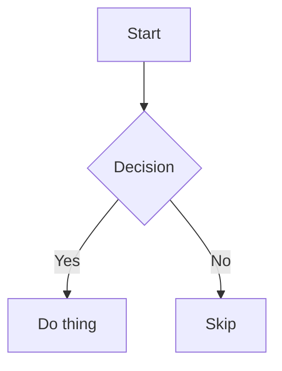

# HUMAN TESTING GUIDE — trying and testing claymark yourself

This is for a person who wants to actually run the app and poke at it — not run the
automated test suite (though that's covered too, at the end). Read `docs/CURRENT-STATE.md`
first if you want the "what is this" context.

---

## 1. Fastest way to see it running

You don't need to build anything to look at rendered output — the dev server is enough.

```bash
cd claymark
nvm use              # match .nvmrc, currently 20.11.1
pnpm install --frozen-lockfile
npx vite --mode app --port 5173   # there is no "pnpm dev" script — this is the equivalent
```

Open `http://localhost:5173` in a browser. This serves the same app entry
(`src/app/main.tsx`) that `pnpm build:app` builds for production, just unbundled and with
hot reload.

**What you should see:** a short sample document (a "claymark" heading, a description, a
bullet list, a code block, and a table) typing itself out on load — that's the streaming
renderer in action, not a bug or a delay. A "Paste your own Markdown" button in the
top-left reveals a plain textarea: type or paste any Markdown there and the rendered
output below updates live. The theme toggle is in the top-right (sun/moon icon).
**Verified this session:** the server starts and returns HTTP 200; the sample renders
correctly in both themes with no console errors, and custom text typed into the textarea
re-renders live.

## 2. Trying the packaged apps instead

**PWA (web app):**
```bash
pnpm build:app
```
Serve `dist/app/` with any static file server (e.g. `npx serve dist/app`) and open it in
a browser. Try installing it via the browser's "Install app" prompt (address bar icon on
Chrome/Edge desktop) — it should work offline after the first load.

**Desktop app (Tauri):**
Prebuilt Linux artifacts are at `desktop/target/release/bundle/`:
- `deb/claymark_1.0.0_amd64.deb` — `sudo dpkg -i` on Debian/Ubuntu
- `rpm/claymark-1.0.0-1.x86_64.rpm` — on Fedora/RHEL-family systems
- `appimage/claymark_1.0.0_amd64.AppImage` — `chmod +x` then run directly, no install needed

The AppImage is the easiest to try with zero commitment:
```bash
chmod +x desktop/target/release/bundle/appimage/claymark_1.0.0_amd64.AppImage
./desktop/target/release/bundle/appimage/claymark_1.0.0_amd64.AppImage
```
A window should open showing the rendered app. Requires a desktop session with a display
(won't produce a visible window over SSH/headless — see §4 for what to check instead).

## 3. What to actually try, as a human

Paste or type each of these into the app and check the described behavior. None of this
should crash, freeze, or show raw/garbled text.

### Basic Markdown
- Headings, bold/italic, lists, links, blockquotes — should look typographically clean in
  both light and dark theme.
- A table with more columns than fit the width — it should scroll horizontally *inside the
  table*, and the page itself should never grow a horizontal scrollbar.

### Code
- A fenced code block with a common language (` ```python `, ` ```typescript `, etc.) —
  should be syntax highlighted.
- A fenced code block with a made-up/unsupported language tag — should render as plain
  unstyled text, not error.
- Click the copy button on a code block — clipboard should get the exact source, no line
  numbers or decoration included.

### Math
- Inline: `` The area is $\pi r^2$. ``
- Display: 
  ```
  $$\int_0^\infty e^{-x^2}\,dx = \frac{\sqrt{\pi}}{2}$$
  ```
- Try deliberately broken LaTeX (e.g. an unclosed `\frac{`) — it should degrade gracefully,
  not crash the page.

### Diagrams
A valid Mermaid flowchart:
````

````
Then try an invalid one (garbage inside the fence) — it should fail closed to a visible
code block, not a blank space or a crash.

### Streaming (the core use case)
If there's a streaming demo mode (check the dev harness or app for a "simulate streaming"
toggle), feed it a long document in small chunks and watch for:
- No flicker or reflow of already-rendered content as new text arrives.
- An open code fence or unclosed `**bold` mid-stream renders sensibly, not as garbage —
  and resolves cleanly once the closing marker arrives.

### Theme
- Toggle light/dark via the in-app theme control. Should switch instantly, no flash, and
  persist across a reload.
- Check contrast in both themes — text should be clearly readable, no washed-out combos.

### Security (the important one)
Paste this and confirm **nothing executes** — it should appear as inert, visibly-escaped
text, never as a live element:
```
<script>alert('should never run')</script>

[click me](javascript:alert('should never run'))
```
If any alert box pops up, that's a critical failure — stop and report it immediately.

### Keyboard-only pass
Unplug the mouse (mentally) and Tab through the rendered page — every interactive element
(theme toggle, copy buttons, links) should be reachable and show a visible focus ring.

## 4. If you're testing headless / over SSH (no display)

You can still confirm the binary itself is sound:
```bash
file desktop/target/release/app         # should say "ELF 64-bit ... executable"
DISPLAY=:0 timeout 6 desktop/target/release/app   # should produce no error/crash output
```
This confirms the binary starts without crashing, but it does **not** confirm the GUI
actually renders correctly — that needs a real desktop session per §2–3.

## 5. Running the automated test suite yourself

If you want to double-check what the automation already verified, from the repo root:

```bash
pnpm tsc            # type check — expect 0 errors
pnpm lint           # expect exactly 2 known pre-existing errors (see DEF-004), no new ones
pnpm test           # unit + integration suite — expect 117/118 (1 known flaky, DEF-005)
pnpm test:security  # XSS corpus — must be 100%, zero exceptions
pnpm test:a11y      # accessibility — expect zero axe-core violations
pnpm test:contrast  # color contrast checks
pnpm bench:stress   # stress matrix S-01–S-12 — zero crashes, zero budget breaches
pnpm bench:backtest # 250-document historical corpus replay
```

If `pnpm test` shows a different failure than the S-01 stress-timing flake, or `pnpm lint`
shows more than the 2 known pre-existing errors, that's a real regression — worth flagging.

## 6. Reporting what you find

The single highest-value thing you can report is **the exact Markdown input** that
triggered unexpected behavior, plus what you expected vs. what happened. Input-specific
rendering bugs (a particular pattern of nested emphasis, a specific Mermaid construct,
etc.) are far more useful than "it felt slow" or "looked off."
