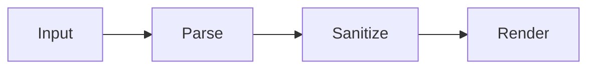

# USER GUIDE

For people **using** claymark to read documents. If you are integrating it into an application, read `API.md` instead.

---

## 1. What it does

claymark turns Markdown into a clean reading surface: serif body type on a comfortable measure, syntax-highlighted code, typeset mathematics, rendered diagrams, and readable tables. It works offline, follows your system theme, and never executes anything a document asks it to.

---

## 2. Supported syntax

### Text

| You write | You get |
|---|---|
| `**bold**` | **bold** |
| `*italic*` | *italic* |
| `~~struck~~` | ~~struck~~ |
| `` `code` `` | inline code |
| `[text](url)` | a link, underlined |
| `> quoted` | an indented quotation |
| `---` | a horizontal rule |

### Headings

Six levels, `#` through `######`. Each gets an anchor you can link to.

### Lists

```markdown
- unordered
- items
  - nest with two spaces

1. ordered
2. items

- [x] completed task
- [ ] pending task
```

Task checkboxes are display-only — they show state but are not clickable, because the document is a rendering, not a form.

### Code

Tag the fence with a language for highlighting:

````markdown
```python
def greet(name: str) -> str:
    return f"Hello, {name}"
```
````

Thirty-four languages are supported. Anything else renders as plain preformatted text — that is expected, not a failure.

**Highlighting specific lines** — add a range in braces:

````markdown
```js {2,4-6}
```
````

Every code block has a **copy button** in its header. It copies exactly the source, without line numbers or highlighting artifacts.

### Tables

```markdown
| Left | Center | Right |
|:-----|:------:|------:|
| a    |   b    |     c |
```

Wide tables scroll horizontally inside their own container. The page itself never scrolls sideways.

### Mathematics

Inline with single dollars, display with double:

```markdown
Euler's identity is $e^{i\pi} + 1 = 0$.

$$
\int_{-\infty}^{\infty} e^{-x^2}\,dx = \sqrt{\pi}
$$
```

Malformed TeX shows an error inline rather than breaking the page.

### Diagrams

Use a `mermaid` fence:

````markdown

````

Flowcharts, sequence diagrams, class diagrams, state diagrams, ER diagrams, Gantt charts, and pie charts are supported. Invalid syntax falls back to showing the diagram source as a code block.

### Images

```markdown

```

Alt text is used by screen readers; the title becomes a visible caption.

> **As-built note (T-P9-06):** a `Lightbox` component exists in the source tree but is not wired into the image-rendering path — clicking an image does not currently open a lightbox. Lazy loading, a responsive `max-width` clamp, and CLS-free aspect-ratio reservation (when the source provides `width`/`height`) are the image behaviors actually shipped.

---

## 3. Reading features

**Theme.** Follows your system light/dark setting automatically. Use the toggle to override; your choice is remembered.

**Copy.** Every code block copies with one click.

**Offline.** After the first load, everything works without a network connection.

---

## 4. Keyboard

| Key | Action |
|---|---|
| `Tab` / `Shift+Tab` | Move between links, buttons, and scrollable regions |
| `Enter` / `Space` | Activate the focused control |
| `←` `→` | Scroll a focused code block or table horizontally |

Everything is reachable without a mouse. Focus is always visible and, after a dialog closes, always restored.

---

## 5. Accessibility

- Conforms to WCAG 2.2 Level AA
- Semantic HTML throughout — headings, lists, and tables are announced correctly
- Math is exposed as MathML to screen readers
- Diagrams carry text alternatives
- Contrast meets AA in both themes
- Animations are suppressed when your system requests reduced motion

---

## 6. What it deliberately will not do

Some of these look like missing features. They are decisions.

| Behavior | Why |
|---|---|
| Raw HTML in a document is shown as text, not rendered | HTML in untrusted documents is the primary attack surface. It is disabled entirely, without an override. |
| Task checkboxes are not clickable | This is a renderer, not a form. State lives in the source. |
| Documents cannot load remote resources | Zero runtime network requests, by design. This is what makes offline reliable and tracking impossible. |
| Unregistered code languages are not highlighted | Bundling every grammar would multiply the download size. |
| Documents cannot supply their own styles | A document that can style itself can disguise itself. |

---

## 7. Troubleshooting

| Symptom | Explanation |
|---|---|
| Code block is not colored | Language is outside the 34-language registry, or the fence has no language tag |
| Math shows as raw `$…$` | The math runtime is still loading, or the TeX has a syntax error |
| Diagram shows as a code block | The Mermaid syntax is invalid — check for a missing diagram-type keyword on the first line |
| HTML appears as literal text | Working as intended, see §6 |
| Image does not display | The URL scheme is blocked; only `http`, `https`, and image `data:` URIs are permitted |
| Theme resets on reload | Browser storage is blocked or cleared — check private-browsing settings |
