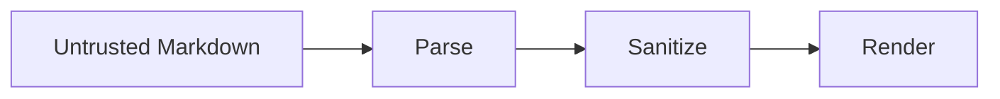

# claymark

A Markdown renderer built for **streamed, untrusted LLM output**.

## What it renders

- CommonMark + GFM (tables, task lists, strikethrough)
- Syntax-highlighted code
- Math and Mermaid diagrams

```ts
import { processor, toReact } from "claymark";

const tree = processor.parse(source);
const hast = await processor.run(tree);
```

| Feature | Status |
|---|---|
| Streaming | ✅ |
| Sanitization | ✅ |
| Theming | ✅ |

Try replacing this text in the box below — see `docs/API.md` for the full surface.

## A closer look

### Math

Inline, like the Gaussian $e^{-x^2/2\sigma^2}$, or display:

$$
\int_{-\infty}^{\infty} e^{-x^2}\,dx = \sqrt{\pi}
$$

### Diagram



### Tasks and quotes

- [x] Render untrusted input safely
- [x] Highlight 34 languages
- [ ] Stream from a live model

> Raw HTML is shown as text, never executed: <script>alert("nope")</script>

Code with highlighted lines and line numbers:

```python {2} showLineNumbers
def greet(name: str) -> str:
    return f"Hello, {name}!"
```

~~Strikethrough~~, *emphasis*, and a [safe link](https://commonmark.org). Pill values like `#d97757` and `1.0.0`; file references like `src/app.tsx`.
